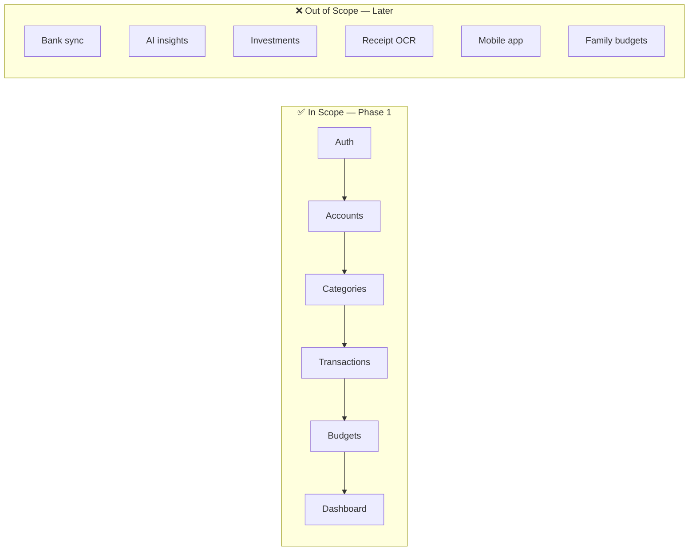
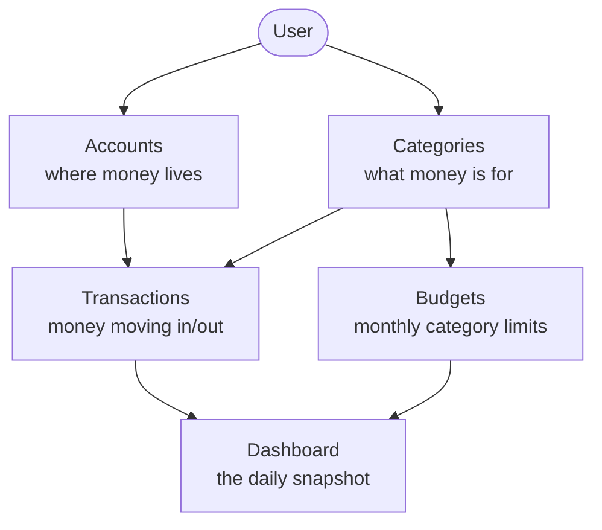
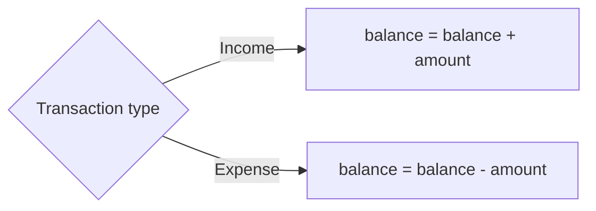
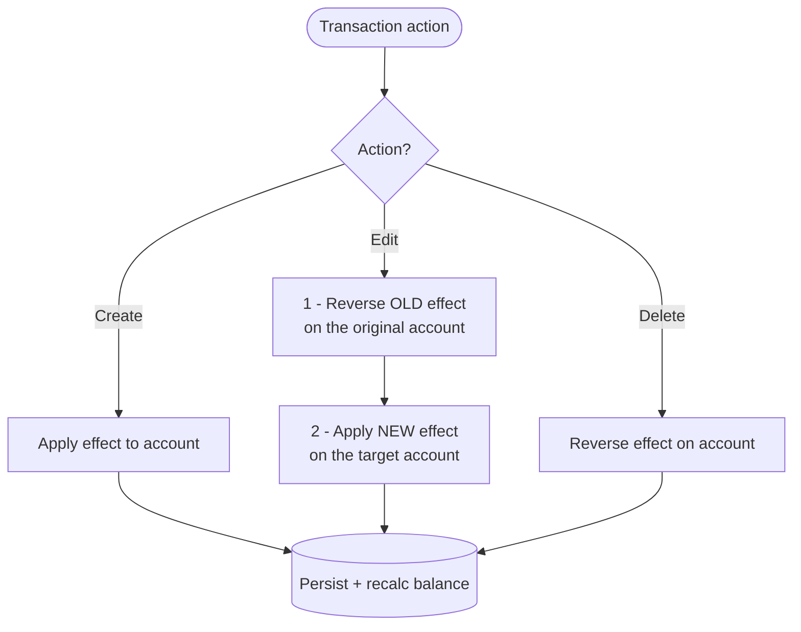
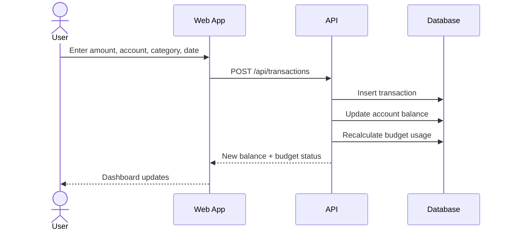
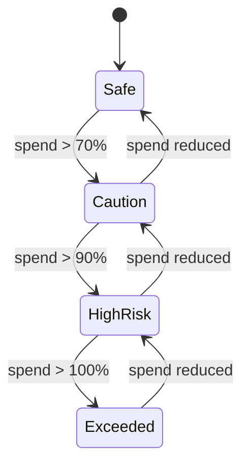
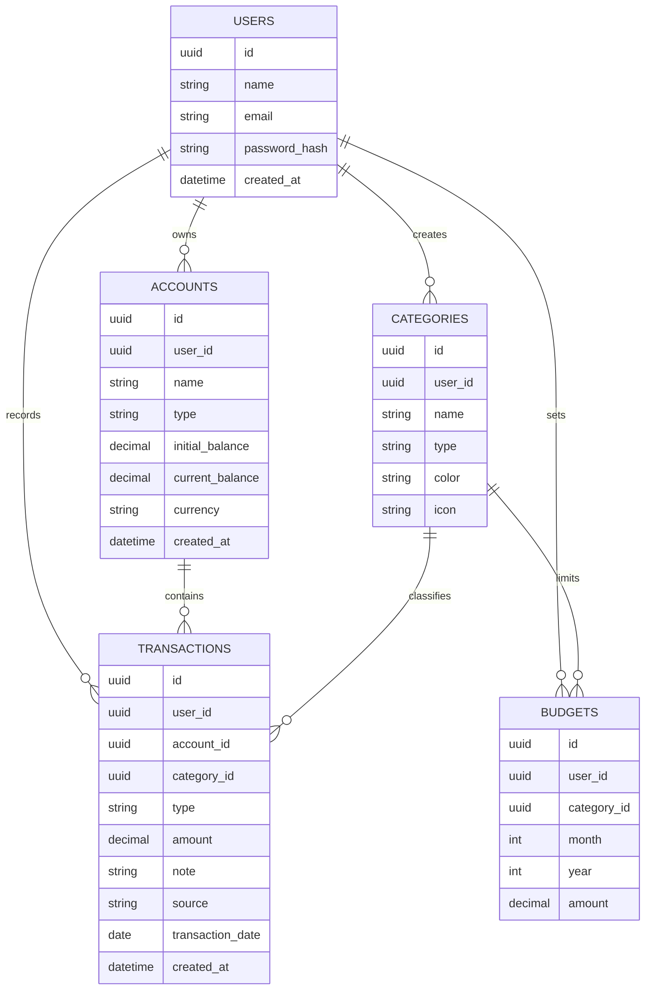
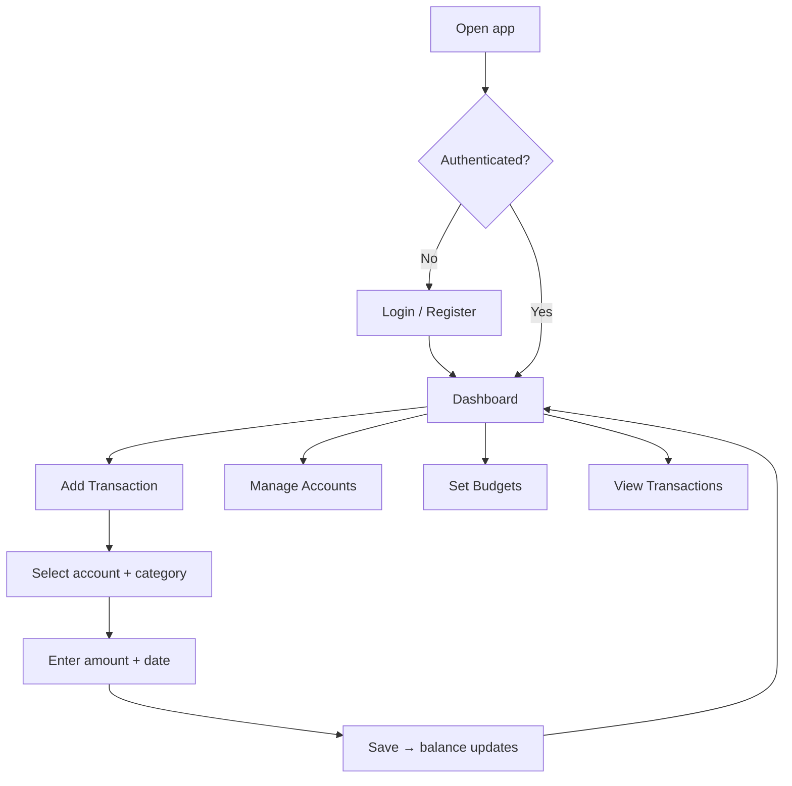
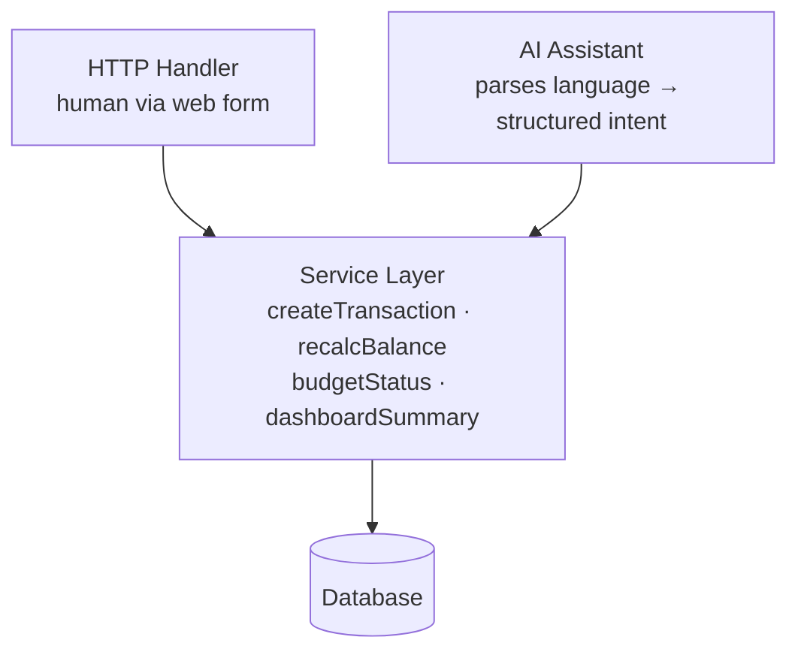

# LedgerFlow — Business Requirements Document (v2)

> **One line:** LedgerFlow is a personal finance tracker that turns scattered daily spending into a single, honest answer to *"Can I afford this right now?"*

---

## 1. Product Vision

Most finance apps either drown you in accounting features or are too generic to match how you actually budget. LedgerFlow does one thing well: **it keeps an accurate running picture of your money and your budgets, so financial decisions stop being guesswork.**

It is not an accounting suite. It is a discipline tool. Every feature exists to answer five practical questions:

| The user asks… | LedgerFlow answers with… |
|---|---|
| How much money do I have? | Total balance across all accounts |
| How much did I spend this month? | Monthly expense summary |
| Where is my money going? | Top spending categories |
| Am I still within budget? | Per-category budget status |
| How much can I safely spend? | Remaining budget + daily average |

**Success = the user opens the app and understands their financial position in under 10 seconds.**

**Long-term differentiator (Phase 2):** an AI assistant that lets the user log spending and ask money questions in plain language — removing the entry friction that makes most trackers fail. Phase 1 ships nothing AI, but is architected so the assistant slots in without a rewrite (see §12).

---

## 2. The Problem

The target user struggles to manage daily, monthly, and yearly spending. They've tried other tools, but each one is too complex, too generic, or built around a budgeting style that isn't theirs. The result: no reliable sense of how much money exists *right now* or whether this month is on track.

LedgerFlow solves this by being fast to enter data into and instantly clear to read.

---

## 3. Goals & Non-Goals (Phase 1)



**Phase 1 ships when the core loop works end to end: record money in/out → see it reflected in balances → know if you're within budget.** Everything else waits.

---

## 4. Target User

A single individual managing their own money. They want:

- **Fast entry** — logging a transaction should take seconds, not a form full of fields.
- **Clear budgets** — know the limit, the spend, and what's left at a glance.
- **A simple monthly review** — not a 12-tab accounting report.

---

## 5. How It Works — Core Concepts

Five entities, one relationship map. This is the whole mental model:



- **Accounts** — Cash, bank, e-wallet, savings, credit card. Each has a balance.
- **Categories** — Income (Salary, Freelance) and Expense (Food, Rent, Transport…).
- **Transactions** — The core record. Income or expense, tied to one account and one category.
- **Budgets** — A monthly spending cap on an expense category.
- **Dashboard** — The read layer. Aggregates everything into a snapshot.

---

## 6. Core Business Logic

This is the heart of the system. Get this right and the rest is UI.

### 6.1 How a transaction affects an account



### 6.2 The hard part: edits and deletes

A transaction's effect must be **reversed before any change**, or balances drift out of sync. This is the single most important rule in LedgerFlow.



> ⚠️ **Note for edits:** the account *or* the amount *or* the type may change. Always reverse the old version completely, then apply the new version cleanly. Never patch a balance incrementally on edit.

### 6.3 Adding a transaction — end to end



### 6.4 Budget status — a state machine

For each category budget per month:

```txt
spent      = sum of expenses in that category, that month
remaining  = budget_amount - spent
used_pct   = spent / budget_amount * 100
```

The `used_pct` drives a visible status that moves both ways as spending changes:



| Status | Range | Meaning |
|---|---|---|
| 🟢 Safe | 0–70% | On track |
| 🟡 Caution | 71–90% | Slow down |
| 🟠 High risk | 91–100% | Near the limit |
| 🔴 Exceeded | >100% | Over budget |

### 6.5 Dashboard math

For the selected month:

```txt
monthly_income          = sum of income transactions
monthly_expense         = sum of expense transactions
net_savings             = monthly_income - monthly_expense
daily_average_spending  = monthly_expense / days_passed_in_month
```

---

## 7. Data Model



> 💡 **Implementation notes:**
> - Store money as `decimal`, never `float`.
> - Decide whether `current_balance` is *stored* (fast reads, risk of drift) or *derived* (always correct, slower). For Phase 1, stored-and-recalculated-on-write is pragmatic — the lifecycle logic in §6.2 keeps it correct.
> - `source` records how a transaction was created (`manual` / `ai` / `import`). Default `manual` in Phase 1; it exists now so AI-created records can be flagged later without a migration.

---

## 8. User Flow



---

## 9. Main Screens

| Screen | Purpose | Key elements |
|---|---|---|
| **Dashboard** | Financial snapshot | Total balance, monthly income/expense, remaining budget, spending-by-category chart, recent transactions |
| **Accounts** | Manage where money lives | List, create/edit/delete, balance per account |
| **Transactions** | Record & review | List, add/edit/delete, filter by date/category/account/type |
| **Budgets** | Set & track limits | Monthly list, spent, remaining, used % with status color |

---

## 10. API Overview

```http
# Auth
POST /api/auth/register
POST /api/auth/login
POST /api/auth/logout
GET  /api/auth/me

# Accounts
GET|POST       /api/accounts
PATCH|DELETE   /api/accounts/:id

# Categories
GET|POST       /api/categories
PATCH|DELETE   /api/categories/:id

# Transactions
GET|POST       /api/transactions
PATCH|DELETE   /api/transactions/:id

# Budgets
GET  /api/budgets?month=6&year=2026
POST /api/budgets
PATCH|DELETE   /api/budgets/:id

# Dashboard
GET  /api/dashboard/summary?month=6&year=2026
```

---

## 11. Success Criteria

Phase 1 is done when the user can:

1. Register and log in.
2. Create accounts and add income/expense transactions.
3. See balances update correctly — including after edits and deletes.
4. Set monthly category budgets and see live status.
5. Open the dashboard and understand their position at a glance.

---

## 12. Designing for AI (Phase 2 Foundation)

The flagship Phase 2 feature is an AI assistant that removes entry friction and surfaces insight. For a user who runs chaotic, the win is typing *"spent 250 on coffee and 80 on grab yesterday"* and having it become two correct, categorized transactions — plus answering *"how much did I spend eating out last month?"* in plain language.

**Phase 1 builds zero AI. It builds so AI slots in without a rewrite.** AI features need clean structured data and business logic a caller other than a web form can invoke — not exotic infrastructure.

### What the AI will do (Phase 2)
- **Natural-language entry** — text/voice → proposed transactions the user confirms.
- **Conversational queries** — "what's my biggest expense this month?"
- **Insights & nudges** — "at this pace you'll exceed Food by the 24th."
- **Auto-categorization** — infer the category from the description.

### The one rule that makes it possible
All business logic lives in a **service layer**, never inside HTTP handlers. The AI assistant then becomes just another caller of the same services a human triggers.



If `createTransaction()` is a function the controller calls, AI entry = parse text → build the same object → call the same function. Same validation, same balance logic, zero duplication. If that logic lives inside the route handler, Phase 2 is a rewrite. **This is the single decision that matters.**

### Cheap things to do in Phase 1
| Decision | Why it helps Phase 2 |
|---|---|
| `source` field on transactions | Flag, confirm, and undo AI-created records |
| Keep the raw `note` text | Raw input is what the AI parses and learns category patterns from |
| Aggregation in reusable services | AI answers "how much on X" by calling these, not re-querying |
| One isolated LLM-client boundary | A single module to fill in later; nothing leaks into core logic |

### What NOT to build in Phase 1 (or maybe ever)
One user, tiny data — it all fits in an LLM context window. So skip:
- ❌ Vector database / embeddings / RAG — pass recent transactions as context instead.
- ❌ Job queue / async workers — keep AI calls synchronous until proven slow.
- ❌ A separate AI microservice — it's a module, not a service.
- ❌ Streaming infra, fine-tuning, agent frameworks.

Adding these now is the over-engineering trap. A clean service layer and a `source` column is the entire foundation.

---

## 13. Roadmap (Phase 2+)

Transfers between accounts · recurring transactions · saving goals · yearly planning · CSV import/export · receipt upload · email reminders · PWA/mobile · multi-currency · AI insights.

*None of these block Phase 1. They are explicitly deferred.*
