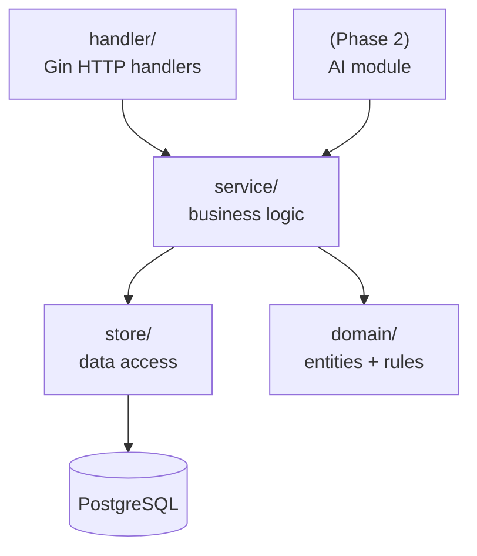
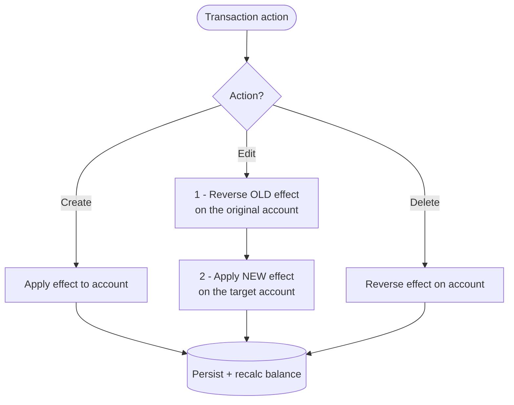
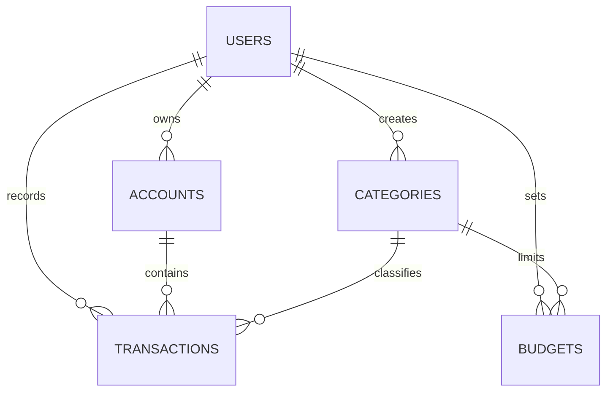
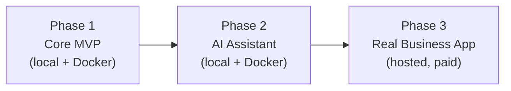

# LedgerFlow — Technical Specification (v1)

> **Scope of this document:** This is the *technical* counterpart to the Business Requirements Document (BRD v2). The BRD defines **what** LedgerFlow is and **why**; this document defines **how** it is built — the stack, repository structure, architecture, local environment, and a phased delivery plan. Where the BRD states business rules (e.g. the balance lifecycle, budget status), this document specifies their implementation.
>
> **Primary goal of Phase 1:** Learning full-stack development with a correct, well-structured codebase. **Phase 3** is where LedgerFlow becomes a real business application.

---

## 1. Guiding Principles

These principles govern every decision below. When in doubt, defer to them.

1. **Service layer is sacred (BRD §12).** All business logic lives in a service layer that HTTP handlers call. Handlers do not contain logic. This is the single most important architectural rule — it is what makes the Phase 2 AI assistant a *new caller*, not a rewrite.
2. **Build for today's scale, not imagined scale.** One user, five entities, four screens. Infrastructure is sized to that reality. Adding scale infrastructure before there is scale is the over-engineering trap the BRD explicitly warns against.
3. **Stay host-portable.** Containerized, configured via environment variables, talking to plain Postgres. The hosting provider is a swap, not a commitment.
4. **Money is never a float.** All monetary values use a decimal type end to end.
5. **Correctness over speed in the balance lifecycle.** The reverse-then-apply rule (BRD §6.2) is the part that determines whether the app works at all.

---

## 2. Technology Stack

| Layer | Choice | Rationale |
|---|---|---|
| **Backend language** | Go | Compiles to a single dependency-free binary; the compiler enforces the service-layer package boundary. |
| **Backend framework** | Gin | Fast, mainstream, minimal; makes thin handlers easy. |
| **Database** | PostgreSQL | Relational fit for the entity model; `NUMERIC`/`DECIMAL` for money. |
| **API style** | REST (JSON) | Matches the BRD's endpoint design; simple to consume and to test. |
| **Decimal handling** | `shopspring/decimal` | Go has no native decimal type; money must never touch `float64`. |
| **Frontend build** | Vite | Fast SPA tooling; outputs a static bundle. No SSR needed (auth-walled app, no SEO surface). |
| **Frontend language** | TypeScript | Non-negotiable for a money app; consumes generated API types. |
| **Frontend framework** | React | Largest ecosystem for the app's needs; strongest tooling support. |
| **Component library** | Mantine | Import-and-go (no owned component source to maintain); batteries included — forms, dates, charts, notifications, hooks. Uses its own styling system. |
| **Server state** | TanStack Query | Caches API data and auto-refetches after mutations; maps directly onto the BRD's "add transaction → balances/dashboard update" loop. No Redux. |
| **Forms / validation** | `@mantine/form` (+ optional Zod) | Supports the "fast entry in seconds" goal. |
| **Charts** | `@mantine/charts` (Recharts under the hood) | Spending-by-category chart; stays within the Mantine ecosystem. |
| **Routing** | React Router | Standard SPA routing. |
| **Containerization** | Docker + docker-compose | Local dev environment and portability foundation. |
| **CI** | GitHub Actions (lightweight) | Test + build on push. Added mid-Phase 1, not day one. |

> **Styling note:** Mantine brings its own styling system. Do **not** add Tailwind alongside it — pick one styling paradigm.

---

## 3. Repository Structure

A single git repository (monorepo) with two **sibling** top-level folders. Go and JavaScript do not share a package manager, so this is "two independently-tooled projects in one repo with a thin task runner," not a workspace-style monorepo.

```text
ledgerflow/
├── backend/                    # Go module — go.mod lives HERE (not at root)
│   ├── cmd/
│   │   └── server/
│   │       └── main.go         # wiring only: config, router, DB, start
│   ├── internal/
│   │   ├── handler/            # thin Gin handlers: parse → call service → respond
│   │   ├── service/            # THE business logic (BRD §12)
│   │   ├── domain/             # entities, money type, lifecycle rules (BRD §6.2)
│   │   └── store/              # DB access; balance recalc on write
│   ├── api/
│   │   └── openapi.yaml        # API contract — single source of truth
│   ├── Dockerfile
│   └── go.mod
├── frontend/                   # React app — package.json lives HERE (not at root)
│   ├── src/
│   │   ├── api/
│   │   │   └── generated/      # TS client generated from openapi.yaml
│   │   ├── features/           # one folder per domain area
│   │   ├── components/
│   │   └── routes/
│   ├── Dockerfile              # (or static build served elsewhere)
│   └── package.json
├── docker-compose.yml          # local: backend + Postgres (+ optionally frontend)
├── Taskfile.yml / Makefile     # task dev, task test, task generate
├── .env.example
├── .gitignore
└── README.md
```

**Manifest placement rules (these matter more than folder names):**
- `go.mod` lives inside `backend/`, never at the repo root.
- `package.json` lives inside `frontend/`, never at the repo root.
- The repo root stays nearly empty: two folders, a task runner, env example, README, gitignore.

---

## 4. Backend Architecture

### 4.1 Layered design



- **`cmd/server`** — wiring only. Loads config, builds the router, opens the DB pool, starts the server. No logic.
- **`handler/`** — one responsibility: translate HTTP ↔ service calls. Parse and validate request shape (Gin binding via struct tags is fine here for *shape* validation), call a service function, map the result/error to an HTTP response. No business rules.
- **`service/`** — all business logic: `CreateTransaction`, `UpdateTransaction`, `DeleteTransaction`, `RecalcBalance`, `BudgetStatus`, `DashboardSummary`, etc. **Business validation lives here, not in handlers**, so the Phase 2 AI caller gets the same rules.
- **`domain/`** — entities, the money/decimal type, and the lifecycle rules. Pure, framework-free.
- **`store/`** — database access. Owns the `current_balance` write-and-recalc strategy.

### 4.2 The critical rule — transaction lifecycle (BRD §6.2)

A transaction's effect on an account **must be reversed before any change**, or balances drift. This logic lives entirely in `service/` + `domain/`, never in a handler.



- **Income:** `balance = balance + amount`
- **Expense:** `balance = balance - amount`
- **Edit:** the account *or* amount *or* type may change. Always fully reverse the old version, then apply the new version cleanly. Never patch a balance incrementally.
- Multi-step balance changes (e.g. an edit that moves a transaction between accounts) must run inside a **single database transaction** so the account never sits in a half-updated state.

### 4.3 Money handling

- Store as Postgres `NUMERIC` / `DECIMAL`. Never `float`/`double`.
- Represent in Go with `shopspring/decimal`. Money never touches `float64` anywhere in the codebase.
- `current_balance` is **stored and recalculated on write** for Phase 1 (fast reads; the §6.2 lifecycle keeps it correct). Revisit only if drift appears.

---

## 5. Frontend Architecture

- **SPA** built with Vite, output as a static `dist/` bundle. Served either by a static host or by the Go binary.
- **No meta-framework (no Next.js).** The app is auth-walled (no SEO need) and the backend is Go/Gin (no need for JS API routes). Next.js would add a second runtime and fight the clean "SPA → Go API" model.
- **Server state via TanStack Query.** Mutations (add/edit/delete transaction) invalidate the relevant queries so balances, budgets, and the dashboard refresh automatically — the read side of BRD §6.3.
- **Mantine** for all UI components, using its styling system, forms, dates, and charts. No Tailwind, no shadcn (no owned component source to maintain).
- **Generated API client.** Types come from `openapi.yaml` (see §6), keeping the frontend in sync with the backend contract.

Suggested `src/` organization: feature-first (`features/transactions`, `features/budgets`, `features/accounts`, `features/dashboard`), shared UI in `components/`, generated client untouched by hand in `api/generated/`.

---

## 6. API Contract & Type Synchronization

Because Go structs cannot be imported into TypeScript, the contract is defined once and generated to both sides.

- **Source of truth:** `backend/api/openapi.yaml`.
- **Backend:** generate Go server interfaces / request-response types with `oapi-codegen`.
- **Frontend:** generate the TypeScript client/types with `openapi-typescript` (or equivalent) into `frontend/src/api/generated/`.
- **Sync step:** a `task generate` command regenerates both sides. The monorepo's payoff is keeping this in one place.

> For a solo Phase 1 app this small, hand-writing the ~5 entity types on the frontend is an acceptable alternative to generation. Decide once; if hand-writing, treat drift as a known maintenance cost.

### 6.1 Endpoint overview (from BRD §10)

```http
# Auth
POST /api/auth/register
POST /api/auth/login
POST /api/auth/logout
GET  /api/auth/me

# Accounts
GET|POST       /api/accounts
PATCH|DELETE   /api/accounts/:id

# Categories
GET|POST       /api/categories
PATCH|DELETE   /api/categories/:id

# Transactions
GET|POST       /api/transactions
PATCH|DELETE   /api/transactions/:id

# Budgets
GET  /api/budgets?month=6&year=2026
POST /api/budgets
PATCH|DELETE   /api/budgets/:id

# Dashboard
GET  /api/dashboard/summary?month=6&year=2026
```

---

## 7. Data Model

Mirrors BRD §7. Implementation notes follow each rule.



| Entity | Key fields | Notes |
|---|---|---|
| **users** | id (uuid), name, email, password_hash, created_at | Password hashed (e.g. bcrypt/argon2). |
| **accounts** | id, user_id, name, type, initial_balance, current_balance, currency, created_at | `current_balance` stored + recalculated on write. Money = decimal. |
| **categories** | id, user_id, name, type (income/expense), color, icon | — |
| **transactions** | id, user_id, account_id, category_id, type, amount, note, source, transaction_date, created_at | `amount` = decimal. See `source` and `note` below. |
| **budgets** | id, user_id, category_id, month, year, amount | One cap per category per month. |

**Phase-2-enabling fields to add now (cheap, no later migration):**
- **`source`** on transactions (`manual` / `ai` / `import`), default `manual`. Lets AI-created records be flagged, confirmed, and undone later.
- **`note`** raw text preserved as entered — this is what the Phase 2 AI parses and learns category patterns from.

These two fields are the *entire* Phase 1 cost of being AI-ready. Nothing else AI-related is built in Phase 1.

---

## 8. Core Business Logic Specifications

### 8.1 Budget status (BRD §6.4)

```text
spent     = sum of expenses in that category, that month
remaining = budget_amount - spent
used_pct  = spent / budget_amount * 100
```

| Status | Range | Meaning |
|---|---|---|
| Safe | 0–70% | On track |
| Caution | 71–90% | Slow down |
| High risk | 91–100% | Near limit |
| Exceeded | >100% | Over budget |

Status moves **both ways** as spending changes — it is derived from current spend, not latched.

### 8.2 Dashboard math (BRD §6.5)

```text
monthly_income         = sum of income transactions (selected month)
monthly_expense        = sum of expense transactions (selected month)
net_savings            = monthly_income - monthly_expense
daily_average_spending = monthly_expense / days_passed_in_month
```

All four are computed by reusable **service** functions (`DashboardSummary`, `BudgetStatus`) — so the Phase 2 AI answers "how much did I spend on X?" by calling these, not by re-querying.

---

## 9. Local Development Environment

Phase 1 and Phase 2 run **locally on Docker**. Most full-stack learning happens here; hosting is only needed when a public URL is required.

- **Backend:** Go/Gin, run locally or in a container.
- **Database:** Postgres in Docker via `docker-compose` (avoids any hosted free-DB expiry during the build phase).
- **Frontend:** Vite dev server locally.
- **Config:** all secrets and connection strings via environment variables; `.env.example` documents the required keys. Nothing host-specific in code.
- **Task runner:** `Taskfile.yml` or `Makefile` exposing `dev`, `test`, `generate`, `build`.

This local-first setup is the cheapest possible approach (cost: $0) and is where the actual learning happens. It also *is* the portability foundation — the same container runs on any host later.

---

## 10. CI/CD

**Right-sized, added incrementally:**

- **CI (mid-Phase 1):** a single GitHub Actions workflow that runs `go test ./...` and builds the backend container image on push. One YAML file; genuinely educational; transferable skill.
- **CD (deferred to Phase 3):** automated deployment waits until there is a deploy target worth automating. By the phasing below, that is Phase 3.

**Explicitly NOT built (over-engineering guardrails):**
- ❌ **Kubernetes** — orchestration for many containers across many machines. The app is one binary, one DB, one user. Not Phase 1, 2, or 3. (If learning k8s becomes a goal, it is a *separate* track, not part of shipping LedgerFlow.)
- ❌ **Load balancer** — distributes traffic across multiple backend instances. There is one instance. When relevant (Phase 3+ *if* growth occurs), it is typically host-provided, not hand-configured.

The reasoning: setting up scale infrastructure before there is scale is the most common way a solo learning project stalls — weeks lost to YAML while the app never ships.

---

## 11. Hosting & Deployment Strategy

Hosting is deliberately deferred and kept cheap. The discipline that makes this safe: **containerized + env-var config + plain Postgres** → any host is a swap, not a rewrite.

| Phase | Hosting approach | Cost |
|---|---|---|
| **Phase 1 (build)** | Fully local: Docker (Go + Postgres) + Vite dev server. | $0 |
| **Phase 1/2 (need a public URL)** | Frontend on a free static host (e.g. Cloudflare Pages — no time limit). Backend on a free tier (Render free tier, Fly.io free allowance, or Oracle Cloud Always Free VM for always-on). | $0 |
| **Phase 3 (real business)** | Move to a paid host with predictable pricing and the features the business needs. | Justified by revenue |

**Free-tier caveats to plan around (verify current terms before relying on them):**
- Render free **web service sleeps** after inactivity (cold start on next request) and the free **Postgres self-deletes after ~30 days** — fine for throwaway dev data, not for data you care about. Run Postgres locally during the build to sidestep this.
- Render free **static site hosting has no time limit** and no spin-down — the frontend is unaffected.

**Future migration to AWS (or any paid host) is fully supported** because nothing in the code is host-specific. The migration is: provision Postgres (e.g. RDS), restore the DB dump, deploy the existing container (e.g. App Runner / ECS), point DNS, set env vars. Zero application-code changes — *provided* no vendor-specific services leak into the code. The first place that risk appears is Phase 2's file/receipt uploads (BRD roadmap): abstract storage behind an interface so it stays portable.

---

## 12. Delivery Phases



### Phase 1 — Core MVP (current focus)
- Auth, accounts, categories, transactions, budgets, dashboard.
- Correct balance lifecycle (§4.2) including edits and deletes.
- Live budget status and dashboard math.
- Service-layer discipline established from day one.
- Local Docker + Postgres; lightweight CI added mid-phase.
- **Done when:** the user can register, create accounts, add income/expense, see balances update correctly (including after edits/deletes), set monthly budgets with live status, and read their position at a glance.

### Phase 2 — AI Assistant (still local/Docker)
- Natural-language entry: text → proposed transactions the user confirms (written via the *same* `CreateTransaction` service).
- Conversational queries answered by calling existing aggregation services.
- Insights/nudges; auto-categorization from the `note` text.
- **Infrastructure stays minimal** (BRD §12): no vector DB/RAG (pass recent transactions as context), no job queue (synchronous until proven slow), no separate AI microservice (it is a module), one isolated LLM-client boundary. The `source` and `note` fields added in Phase 1 are the only schema prerequisites.

### Phase 3 — Real Business Application
- Subscription & payment system.
- Roles, permissions, and Pro-plan feature limits.
- Additional advanced features.
- Migration from local/free hosting to a paid host with proper pricing and features; CD pipeline introduced here.
- This is where load-balancing/scaling concerns are *first* legitimately considered — and only if real usage demands them.

---

## 13. Open Decisions (to confirm before/while building)

These do not block starting; flag the choice when made.

1. **API client:** generate from OpenAPI (`oapi-codegen` + `openapi-typescript`) vs. hand-write TS types. (Recommendation: generate, but hand-writing is acceptable at this scale.)
2. **DB access in Go:** `sqlc` (type-safe SQL, recommended for learning real SQL) vs. an ORM like GORM. Affects `store/` only.
3. **Auth mechanism:** session cookies vs. JWT. Either works; cookies are simpler for a single SPA + API.
4. **Frontend hosting target** for the first public deploy (Cloudflare Pages recommended).
5. **Backend free-tier target** for the first public deploy (Render vs. Fly.io vs. Oracle Always Free), if/when a public URL is needed.

---

*This spec captures decisions as of the current planning stage. It is a living document — revise as choices in §13 are settled and as phases progress.*
