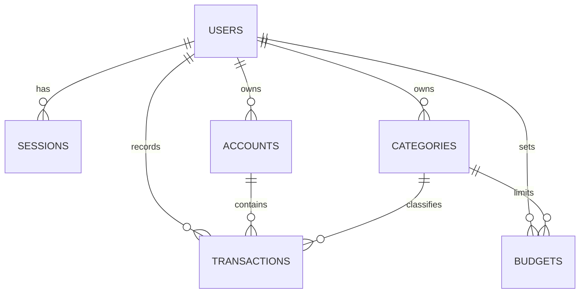

# LedgerFlow Database Design v1

> **Status:** Phase 1 design baseline. The checked-in migrations remain the executable
> source of truth. Update this document when a schema decision changes.

## 1. Purpose and scope

This document defines how LedgerFlow models data in PostgreSQL. It covers the Phase 1
tables, relationships, constraints, indexes, money rules, transaction boundaries, and
migration conventions.

Phase 1 contains only:

- users and sessions
- accounts
- categories
- transactions
- monthly budgets

Transfers, recurring transactions, savings goals, imports, multiple currencies in one
account, and AI-owned tables are outside this design.

## 2. Design rules

1. PostgreSQL protects structural correctness with types, foreign keys, uniqueness, and
   check constraints.
2. Go services protect business rules that depend on several rows or tables.
3. Every user-owned query includes `user_id`. Never authorize access by record ID alone.
4. Money uses `NUMERIC(19,4)` in PostgreSQL and `shopspring/decimal` in Go. Never use a
   floating-point type.
5. Monetary amounts are positive. Transaction `type` decides whether the amount adds to
   or subtracts from an account balance.
6. Instants use `TIMESTAMPTZ`. A user-entered financial day uses `DATE`.
7. Names use plural `snake_case`. Primary keys are UUIDs.
8. Foreign-key columns are indexed only for real access paths. PostgreSQL does not add
   those indexes automatically.
9. Do not use database triggers for balance updates. Keep the write sequence explicit in
   the store and service layers so it is visible, testable, and usable by `sqlc`.

## 3. Relationship model



`transactions.user_id` is intentionally stored even though it can be reached through an
account. It makes authorization and the main transaction-list queries direct. The write
path must ensure the user, account, and category belong together.

## 4. Table design

The columns below are the target shape. Each table can be introduced by the migration
that first needs it. Phase 1 does not require one large migration.

### `users`

| Column | PostgreSQL type | Rules |
| --- | --- | --- |
| `id` | `UUID` | Primary key |
| `name` | `TEXT` | Not null, non-empty |
| `email` | `TEXT` | Not null, unique, stored in normalized lowercase form |
| `password_hash` | `TEXT` | Not null, never store or log a plaintext password |
| `created_at` | `TIMESTAMPTZ` | Not null, default `now()` |
| `updated_at` | `TIMESTAMPTZ` | Not null, default `now()`, updated explicitly by SQL |

The service trims and lowercases email before writing it. The unique constraint is the
final protection against duplicate accounts.

### `sessions`

| Column | PostgreSQL type | Rules |
| --- | --- | --- |
| `id` | `UUID` | Primary key |
| `user_id` | `UUID` | Not null, references `users(id)` with `ON DELETE CASCADE` |
| `token_hash` | `TEXT` | Not null, unique; never store the raw session token |
| `expires_at` | `TIMESTAMPTZ` | Not null |
| `created_at` | `TIMESTAMPTZ` | Not null, default `now()` |

Index `sessions(user_id)`. Add an `expires_at` index only when an expiry-cleanup query is
implemented.

### `accounts`

| Column | PostgreSQL type | Rules |
| --- | --- | --- |
| `id` | `UUID` | Primary key |
| `user_id` | `UUID` | Not null, references `users(id)` with `ON DELETE CASCADE` |
| `name` | `TEXT` | Not null, non-empty |
| `type` | `TEXT` | Not null, constrained to supported Phase 1 values |
| `initial_balance` | `NUMERIC(19,4)` | Not null |
| `current_balance` | `NUMERIC(19,4)` | Not null |
| `currency` | `VARCHAR(3)` | Not null, uppercase ISO 4217 code |
| `archived_at` | `TIMESTAMPTZ` | Nullable |
| `created_at` | `TIMESTAMPTZ` | Not null, default `now()` |
| `updated_at` | `TIMESTAMPTZ` | Not null, default `now()` |

`current_balance` is stored for fast reads. It is not independent data. Its invariant is:

```text
current_balance = initial_balance + income total - expense total
```

An API delete archives an account. It must not cascade-delete financial history.

### `categories`

| Column | PostgreSQL type | Rules |
| --- | --- | --- |
| `id` | `UUID` | Primary key |
| `user_id` | `UUID` | Not null, references `users(id)` with `ON DELETE CASCADE` |
| `name` | `TEXT` | Not null, non-empty |
| `type` | `TEXT` | Not null, check: `income` or `expense` |
| `color` | `TEXT` | Nullable presentation metadata |
| `icon` | `TEXT` | Nullable presentation metadata |
| `archived_at` | `TIMESTAMPTZ` | Nullable |
| `created_at` | `TIMESTAMPTZ` | Not null, default `now()` |
| `updated_at` | `TIMESTAMPTZ` | Not null, default `now()` |

Use a unique constraint on `(user_id, name, type)` after the service normalizes names.
An API delete archives a category. Existing transactions keep their classification.

### `transactions`

| Column | PostgreSQL type | Rules |
| --- | --- | --- |
| `id` | `UUID` | Primary key |
| `user_id` | `UUID` | Not null, references `users(id)` with `ON DELETE CASCADE` |
| `account_id` | `UUID` | Not null, references `accounts(id)` with delete restricted |
| `category_id` | `UUID` | Not null, references `categories(id)` with delete restricted |
| `type` | `TEXT` | Not null, check: `income` or `expense` |
| `amount` | `NUMERIC(19,4)` | Not null, check: `amount > 0` |
| `note` | `TEXT` | Not null, default empty string |
| `source` | `TEXT` | Not null, default `manual`; supported values are `manual`, `ai`, `import` |
| `transaction_date` | `DATE` | Not null, the user's financial calendar day |
| `created_at` | `TIMESTAMPTZ` | Not null, default `now()` |
| `updated_at` | `TIMESTAMPTZ` | Not null, default `now()` |

The service must verify all of these facts before a write:

- the account and category belong to `user_id`
- neither record is archived
- the category type matches the transaction type

Keep `source` and raw `note` now because Phase 2 will reuse the same transaction service.
They do not require Phase 1 AI behavior.

### `budgets`

| Column | PostgreSQL type | Rules |
| --- | --- | --- |
| `id` | `UUID` | Primary key |
| `user_id` | `UUID` | Not null, references `users(id)` with `ON DELETE CASCADE` |
| `category_id` | `UUID` | Not null, references `categories(id)` with delete restricted |
| `month_start` | `DATE` | Not null, check: first day of the month |
| `amount` | `NUMERIC(19,4)` | Not null, check: `amount > 0` |
| `created_at` | `TIMESTAMPTZ` | Not null, default `now()` |
| `updated_at` | `TIMESTAMPTZ` | Not null, default `now()` |

Use one `DATE` instead of separate month and year integers. The API can still accept a
month and year, then convert them to the first day of that month. Enforce one budget with
a unique constraint on `(user_id, category_id, month_start)`. Only expense categories can
have budgets; the service enforces this cross-table rule.

## 5. Transaction and balance lifecycle

Creating, editing, or deleting a transaction changes both `transactions` and
`accounts.current_balance`. Those writes form one database transaction.

### Create

1. Begin a database transaction.
2. Lock the target account row with `SELECT ... FOR UPDATE`.
3. Validate ownership and category compatibility.
4. Insert the transaction.
5. Apply its full balance effect.
6. Commit.

### Edit

1. Begin a database transaction.
2. Load the old transaction.
3. Lock affected account rows in stable UUID order to reduce deadlock risk.
4. Reverse the old transaction's full effect.
5. Validate and write the new transaction values.
6. Apply the new transaction's full effect.
7. Commit.

The account, amount, type, or date may change. Never calculate only the difference between
old and new amounts.

### Delete

1. Begin a database transaction.
2. Load the old transaction and lock its account.
3. Reverse its full balance effect.
4. Delete the transaction.
5. Commit.

Any error rolls back every step. A reconciliation query and integration test must prove
that stored balances equal the transaction-derived balances.

## 6. Initial indexes

Start with indexes that support known Phase 1 queries:

| Index columns | Supports |
| --- | --- |
| `sessions(user_id)` | Revoke or list a user's sessions |
| `accounts(user_id)` | Account list and ownership checks |
| `categories(user_id, type)` | Category picker and ownership checks |
| `transactions(user_id, transaction_date)` | Main list, monthly totals, dashboard |
| `transactions(user_id, account_id, transaction_date)` | Account history |
| `transactions(user_id, category_id, transaction_date)` | Category totals and budget usage |
| `budgets(user_id, month_start)` | Monthly budget list |

Primary keys and unique constraints already create indexes. Do not duplicate them. Use
`EXPLAIN (ANALYZE, BUFFERS)` with realistic data before adding more indexes.

## 7. PostgreSQL choices

- Prefer `TEXT` plus named `CHECK` constraints for small business value sets. Native
  PostgreSQL enums make later value changes harder.
- Prefer `TEXT` or `VARCHAR(n)` only when a real length limit exists. Do not use `CHAR(n)`.
- Use `NOT NULL` unless absence has a clear domain meaning.
- Use `NULL` for optional values. Do not invent sentinel dates or UUIDs.
- Generate UUIDs in Go so domain objects have IDs before persistence. Do not require a
  PostgreSQL extension only for ID generation.
- Store timestamps in UTC through `TIMESTAMPTZ`. PostgreSQL converts them for display.
- Use explicit constraint names so migration and production errors are understandable.

## 8. Migration and `sqlc` workflow

The canonical migration directory is `backend/db/migrations/`.

1. Add a numbered `.up.sql` and matching `.down.sql` file.
2. Never edit a migration that has been shared or applied outside disposable local data.
3. Apply the migration to local PostgreSQL.
4. Inspect tables, columns, constraints, and indexes in PostgreSQL.
5. Run the relevant `sqlc` generation after schema or query changes.
6. Run Go tests.
7. Roll the new migration down, verify removal, then apply it again.

Down migrations drop dependent objects before their parents. For example, drop
`sessions` before `users`. Destructive production changes should use staged migrations,
such as add, backfill, switch reads, and only then remove.

## 9. Ownership of rules

| Rule | Primary enforcement |
| --- | --- |
| Required value, valid amount, allowed type | PostgreSQL constraint |
| Email or monthly budget uniqueness | PostgreSQL unique constraint |
| Parent record exists | PostgreSQL foreign key |
| Requesting user owns every referenced row | Service query scoped by `user_id` |
| Category type matches transaction type | Service inside the database transaction |
| Budget uses an expense category | Service inside the database transaction |
| Balance reverse-then-apply lifecycle | Service and store transaction |
| HTTP input and output shape | Handler |

This split keeps handlers small, makes business behavior testable without HTTP, and uses
PostgreSQL as the final guard against invalid persisted data.

## 10. Required verification

Each schema change is complete only when there is evidence that:

- the up migration applies from a clean database
- expected constraints and indexes exist
- invalid rows are rejected
- the down migration reverses the change in the correct dependency order
- the up migration can be applied again
- `make generate` succeeds when `sqlc` inputs changed
- `make test` passes

Balance lifecycle work also needs a PostgreSQL integration test covering create, edit
amount, edit account, edit type, and delete.
